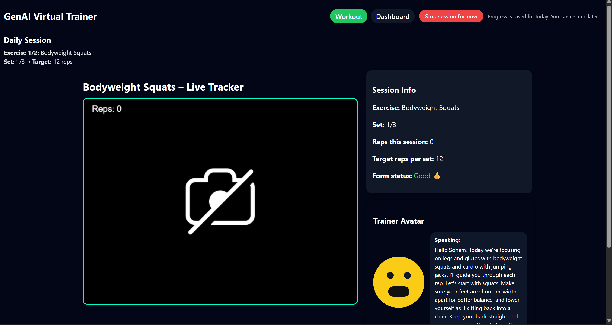
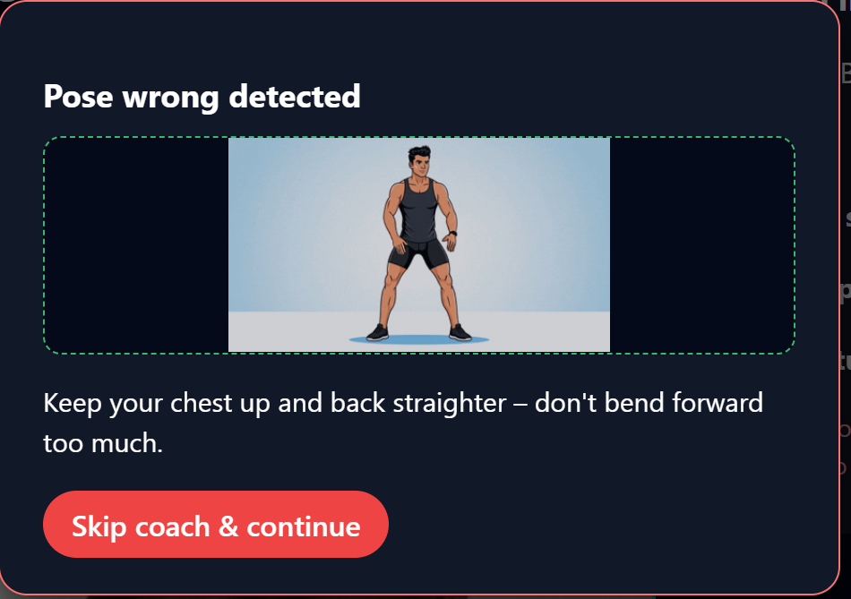
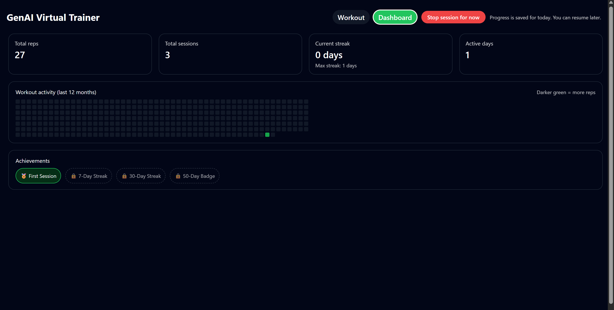

# 🏋️‍♂️ GenAI Virtual Fitness Trainer  
A real-time, intelligent workout assistant powered by **AI coaching**, **vision-based pose detection**, **rep counting**, **form correction**, and a **LeetCode-style fitness dashboard**.

---

## 🚀 Overview  
GenAI Virtual Trainer is a full-stack AI fitness app that helps users work out at home with **live pose tracking** and **conversational coaching** powered by a **local LLM**.

It uses:

- **MediaPipe Pose** → Real-time skeleton tracking  
- **Custom pose logic** → Rep counting + form error detection  
- **Ollama + Mistral** → Local AI trainer  
- **SpeechSynthesis** → Voice feedback  
- **Lip-Synced Avatar** → Realistic speaking animation  
- **Streaks + Achievements Dashboard** → Like GitHub + LeetCode  
- **Session Resume System** → Continue later on the same day  

---

## ✨ Features  

### 🔹 Real-Time Pose Tracking  
- Live skeleton drawing  
- Squats + Jumping Jacks  
- Accurate rep counting  
- Down-phase & up-phase detection  
- Out-of-sync detection for jumping jacks  

---

### 🔹 Smart Form Correction  
Automatically detects:  

- Not deep enough squats  
- Fast bouncing  
- Back bending forward  
- Narrow stance  
- Knees caving in  
- Jumping jack arms not lifting enough  
- Legs not wide enough  
- Arms & legs out of sync  

Each error triggers a **popup with exercise-specific GIF**.

---

### 🔹 AI Personal Coach (LLM-based)  
Your AI trainer:

- Greets you  
- Talks during reps  
- Gives form corrections  
- Encourages last reps  
- Wraps up the session  
- Speaks with lip-sync animation  

Uses **Ollama + `mistral:7b-instruct`** (configurable).

---

### 🔹 LeetCode-Style Dashboard  
Tracks:

- Total reps  
- Total sessions  
- Active days  
- Streaks  
- GitHub-like activity heatmap  
- Achievement badges  

---

### 🔹 Smart Session System  
- Daily auto-save using localStorage  
- Return anytime → continues same workout  
- “Stop session for now” pauses the workout  
- “Hard Reset” backdoor resets everything  

---

## 📸 Screenshots  

- **Main Screen UI**
  
  

- **Wrong Pose PopUp**

  

- **Dashboard UI**
  
  


---

## 🛠️ Tech Stack  

### **Frontend**
- React + TypeScript  
- MediaPipe Pose (CDN)  
- Custom pose algorithms (Squats, Jumping Jacks)  
- Browser **SpeechSynthesis**  
- LipSync viseme-based mouth animation  
- localStorage for session persistence  

### **Backend**
- FastAPI  
- Pydantic v2  
- httpx  
- Ollama (Local LLM runner)  
- Mistral / other compatible LLMs  

---

## 📂 Folder Structure  

  ```bash
GenAI-Based-Virtual-Fitness-Trainer/
│
├── backend/
│   ├── main.py
│   
│
├── frontend/
│   ├── src/
│   │   ├── components/
│   │   │   ├── PoseDetector.tsx
│   │   │   ├── TrainerAvatar.tsx
│   │   │   └── Dashboard.tsx
│   │   ├── App.tsx
│   │   └── storage.ts
│   ├── public/
│   │   └── mediapipe/       # (optional if you ever host MP locally)
│   └── package.json
│
└── README.md
  ```
## ⚙️ How to Run the Project
Before Going to Next Step make sure following prerequsites to be their
- **Node.js ≥ 18**
- **Python ≥ 3.10**
- **Ollama installed locally with a pulled model, e.g.:**
 
  ```bash
  ollama pull mistral:7b-instruct
  ```
1️⃣ **Clone the Repository**
   ```bash
    git clone https://github.com/Soham-bansal/GenAI-Based-Virtual-Fitness-Trainer.git
    cd GenAI-Based-Virtual-Fitness-Trainer
   ```
2️⃣ **⚙️ Backend Setup (FastAPI + Ollama)**
 1. Create a requirements.txt in the backend folder:
    
    ```bash
    fastapi
    uvicorn[standard]
    httpx
    pydantic
    python-dotenv
    ```
2. Create and activate a virtual environment:

   ```bash
     cd backend
    # Create venv
    python -m venv venv
    
    # Activate (Windows)
    venv\Scripts\activate
    
    # or macOS / Linux
    # source venv/bin/activate
   ```
   
3. Install dependencies:
   
   ```bash
     pip install -r requirements.txt
   ```
   
5. Make sure Ollama is running, and (optionally) set environment variables:

   ```bash
     set OLLAMA_URL=http://localhost:11434
     set OLLAMA_MODEL=mistral:7b-instruct
   ```
6. Start the FastAPI server:

   ```bash
    uvicorn main:app --host 0.0.0.0 --port 8000 --reload
   ```

3️⃣ **🖥 Frontend Setup (React + Vite)**
  
  Install & Run

  ```bash
    cd frontend
    npm install
    npm run dev
  ```
  Vite will start the app (usually at http://localhost:5173).

  
Note: The frontend currently calls the backend at
http://localhost:8000/coach/message (hard-coded in TrainerAvatar.tsx).
Make sure your FastAPI backend is running on that URL, or adjust it if needed.

---

## 🧪 Supported Exercises
  Currently implemented:
  - **Bodyweight Squats
  - **Jumping Jakcs**
  Each Exercise has:
  - **Custom pose logic**
  - **Rep detection**
  - **Form error detection**
  - **LLM-based correction messages**

---

## 🏆 Author
Soham Bansal
AI/ML & Full-Stack Developer


